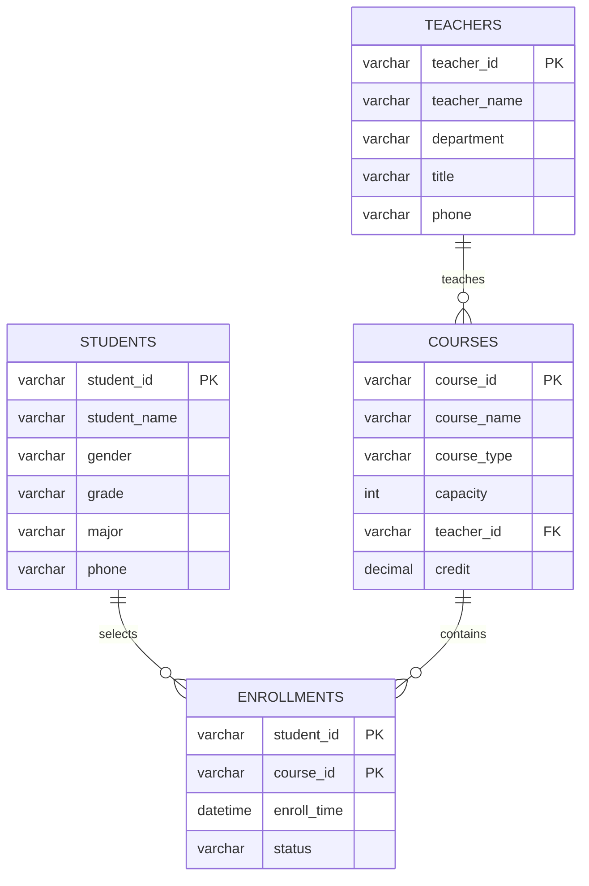

# 分析及设计

## 1. 核心数据模型

### 学生表 students

| 字段名 | 数据类型 | 说明 |
|---|---|---|
| student_id | VARCHAR(20) | 学生ID，主键 |
| student_name | VARCHAR(50) | 学生姓名 |
| gender | VARCHAR(10) | 性别 |
| grade | VARCHAR(20) | 年级 |
| major | VARCHAR(50) | 专业 |
| phone | VARCHAR(20) | 联系电话 |

### 教师表 teachers

| 字段名 | 数据类型 | 说明 |
|---|---|---|
| teacher_id | VARCHAR(20) | 教师ID，主键 |
| teacher_name | VARCHAR(50) | 教师姓名 |
| department | VARCHAR(50) | 所属院系 |
| title | VARCHAR(30) | 职称 |
| phone | VARCHAR(20) | 联系电话 |

### 课程表 courses

| 字段名 | 数据类型 | 说明 |
|---|---|---|
| course_id | VARCHAR(20) | 课程ID，主键 |
| course_name | VARCHAR(50) | 课程名称 |
| course_type | VARCHAR(20) | 课程类型，公共课/专业课/选修课 |
| capacity | INT | 课程容量 |
| teacher_id | VARCHAR(20) | 授课教师ID，外键 |
| credit | DECIMAL(3,1) | 学分 |

### 选课记录表 enrollments

| 字段名 | 数据类型 | 说明 |
|---|---|---|
| student_id | VARCHAR(20) | 学生ID，联合主键 |
| course_id | VARCHAR(20) | 课程ID，联合主键 |
| enroll_time | DATETIME | 选课时间 |
| status | VARCHAR(20) | 选课状态 |

## 表间关联关系

- 一个学生可以选择多门课程。
- 一门课程可以被多个学生选择。
- 学生表和课程表通过选课记录表形成多对多关系。
- 一个教师可以教授多门课程。
- 一门课程关联一个教师。

## ER 图



## 2. 并发风险及解决方案

选课高峰期的核心并发问题：

- 多个学生同时选择同一课程，可能导致课程容量超卖。
- 同一学生重复提交同一门课程，可能产生重复选课记录。
- 多个请求同时更新课程剩余容量，可能导致数据不一致。

简单可行的解决方案：

使用数据库事务、唯一约束和行级锁控制并发。

处理流程：

```text
1. 开启数据库事务。
2. 根据 course_id 查询课程记录，并使用 SELECT ... FOR UPDATE 加行级锁。
3. 判断当前课程已选人数是否小于课程容量。
4. 如果容量未满，插入选课记录。
5. enrollments 表使用 student_id + course_id 联合主键，防止重复选课。
6. 提交事务。
```

该方案实现简单，适合基础选课系统，能同时解决超卖和重复选课问题。

## 3. 索引设计

### enrollments 表

```sql
ALTER TABLE enrollments
ADD PRIMARY KEY (student_id, course_id);
```

索引类型：联合主键索引。

设计理由：防止同一学生重复选择同一门课程，同时提升按学生ID、课程ID查询选课记录的效率。

```sql
CREATE INDEX idx_enrollments_course_id ON enrollments(course_id);
```

索引类型：普通索引。

设计理由：统计某门课程选课人数时会频繁按 `course_id` 查询和分组。

```sql
CREATE INDEX idx_enrollments_enroll_time ON enrollments(enroll_time);
```

索引类型：普通索引。

设计理由：便于按选课时间查询或分析高峰期选课数据。

### courses 表

```sql
ALTER TABLE courses
ADD PRIMARY KEY (course_id);
```

索引类型：主键索引。

设计理由：课程ID是课程表唯一标识，也是与选课记录表关联的核心字段。

```sql
CREATE INDEX idx_courses_course_type ON courses(course_type);
```

索引类型：普通索引。

设计理由：题目要求统计专业课，按课程类型过滤时可提升查询效率。

```sql
CREATE INDEX idx_courses_teacher_id ON courses(teacher_id);
```

索引类型：普通索引。

设计理由：课程与教师存在关联，按教师查询其授课课程时可以提升效率。
